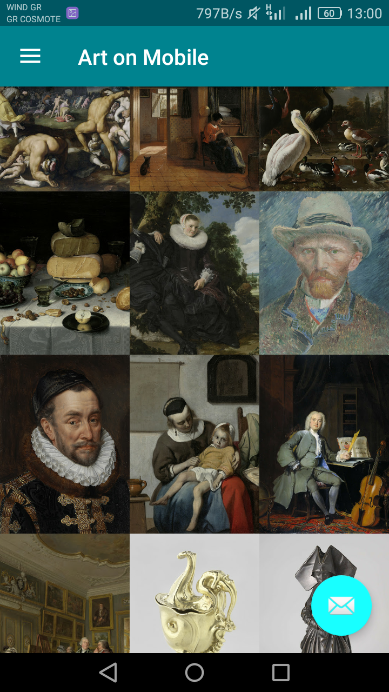
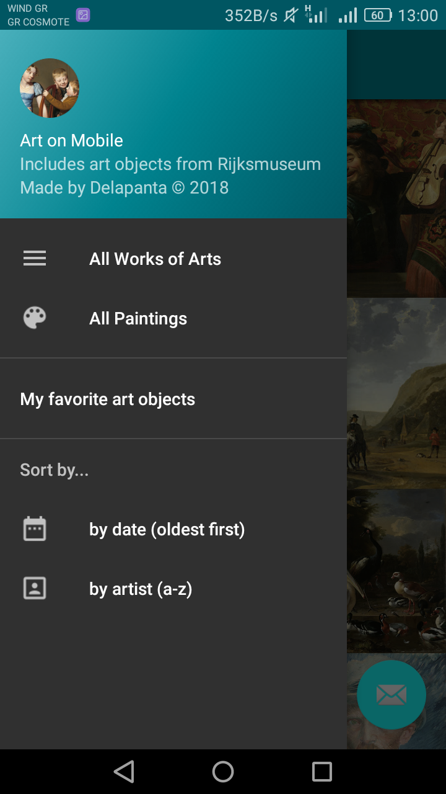
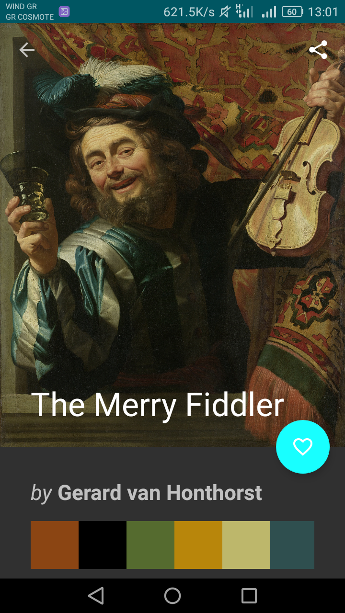
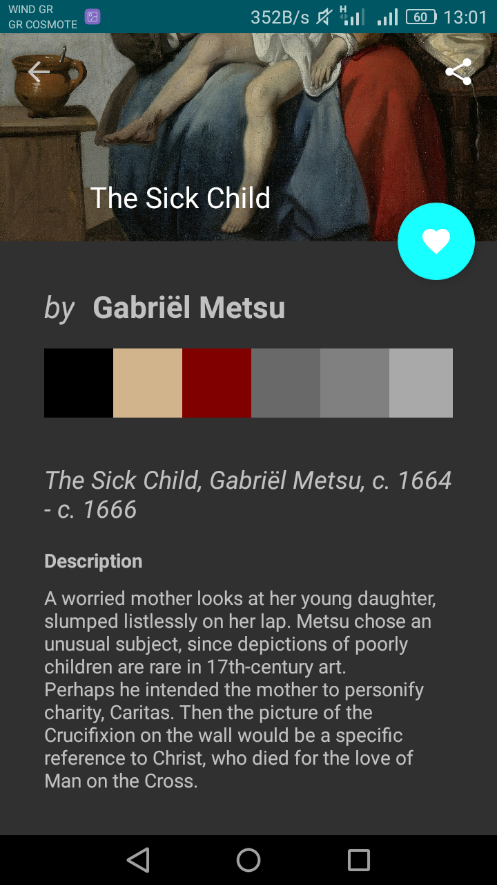
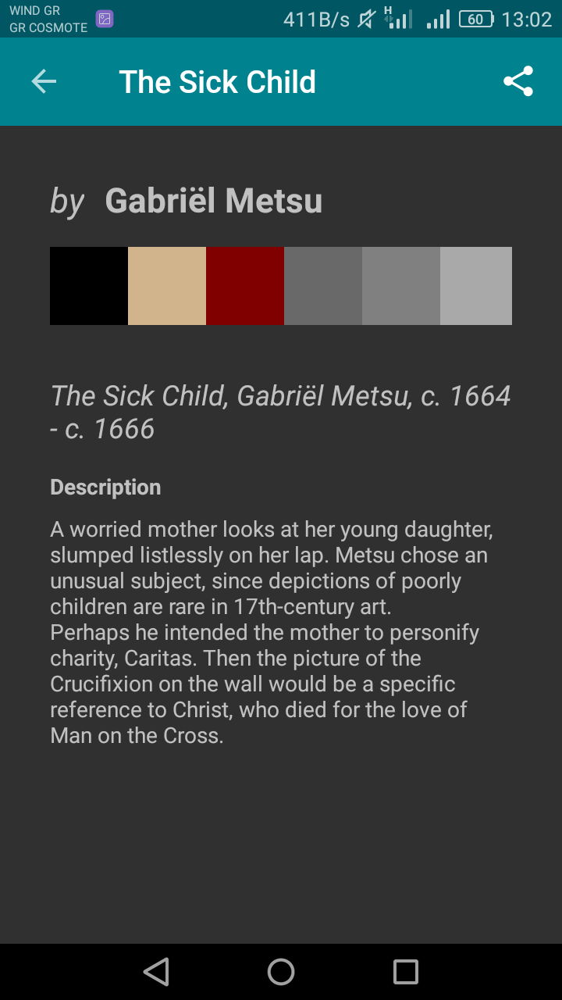

# Art on Mobile App
Art on mobile is an app which tries to bring art to everyone. The art objects belongs to Rijksmuseum collection, which currently has 639040 art objects in its database. The user could browse the collections, read additional informations for an art object and save it locally in favorites category for offline use. The art objects can be sorted by chronological order (from oldest to newest or the opposite). Finally, app’s widget brings user’s favorite pieces of art on his smartphone screen.

It is a project during Udacity's Android Developer Nanodegree Program.

This is an app for art lovers, students, kids and generally for anyone with interest in arts.

## Features

The app will:
<ul><li>Upon launch, present the user with an grid arrangement of art objects from the Rijksmuseum collection. </li>
<li>Allow the user to change sort order via a setting:</li>
<ul>
<li>The sort order can be chronological, by newest to oldest or the opposite</li>
</ul>
<li>Allow the user to tap on an art object and transition to a details screen with additional information such as:</li>
<ul>
<li>Image</li>
<li>Title</li>
<li>Artist/Creator</li>
<li>Description</li>
<li>The basic normalized colors of the art object</li>
</ul>
<li>Αllow the user to mark an art object as a favorite in the details view by tapping on the fab button with the heart. This is for a local art objects collection that will be maintain and does not require an API request*.</li>
<li>Allow the user to view a collection with his favorites art objects via a choice in navigation drawer.</li>
<li>Allow the user to display his favorite art objects in a widget.</li>
  </ul>

## Libraries:
<ul>
<li>Okhttp3 for network calls.</li>
<li>Retrofit to consume JSON data.</li>
<li>ButterKnife for binding the views.</li>
<li>Picasso to handle the loading and caching of images.</li>
<li>Design Support Library in order to take advantage of library’s features like FAB, NavigationView, SnackBar, CoordinatorLayout and many more.</li>
</ul>

## Google Play services:
<ul>
<li>Google Analytics to track usage data. Notice that only one analytics instance will be created.</li>
<li>Google Mobile Ads to display banner ads for use with DoubleClick for Publishers (DFP). Notice that test ads will be displayed.</li>
</ul>

## Access to the API
To access the data and images, you will first need to obtain an API key. You can do this via the advanced settings of your Rijksstudio account [https://www.rijksmuseum.nl/en/rijksstudio/my/profile]. You will be given a key instantly upon request. Every request to the API must be accompanied by this key.
And you should then put the key in build.gradle (Module app) where you can find RIJKSMUSEUM_API_KEY_GOES_HERE

<h2> App's screenshots</h2>

   

   

   

